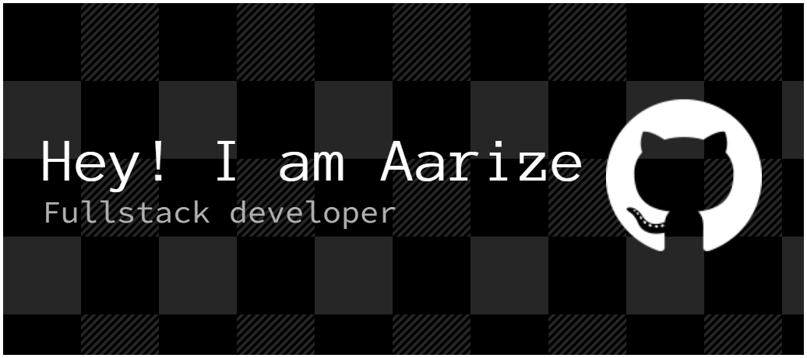

<!-- Bannière -->

  

<h3 align="center">Développeur en apprentissage, passionné par le code</h3>

  <em>"Toute technologie suffisamment avancée est indiscernable de la magie. Arthur C. Clarke"</em>

---

### 🚀 À propos de moi
- 🎯 En apprentissage du développement web & logiciel  
- 🎮 Intéressé par la création de bots Discord & projets gaming  
- 📚 Curieux d’explorer **Java, Node.js, React** et plus encore  
- ✨ Objectif : progresser, partager mes projets & contribuer à l’open-source  

---

### 🛠️ Compétences & Outils

  

---

### 📚 En apprentissage
- 🔹 Approfondissement de **Java** & **Node.js**  
- 🔹 Premiers projets avec **React**  
- 🔹 Expérimentations avec **docker** et **lmstudio**  

---

### 🛤️ Roadmap 2025
- [ ] Lancer 5 projets publics sur GitHub  
- [ ] Publier un site complet en ligne  
- [ ] Contribuer à un projet open-source  
- [ ] Approfondir Docker & l’IA  

---

### 🚧 Mes projets GitHub

  
  

---

### 🎉 Fun facts
- 🎮 J’adore decouvrir de nouveaux environnement pour ensuite voir a quelle point j'aimais l'ancien 
- 🎧 Je code souvent en musique  
- ☕ Le diabolo fraise > toutes les autres boissons  

---

### 📫 Me contacter

  
  

---

### 🐍 Animation des contributions

---

  

